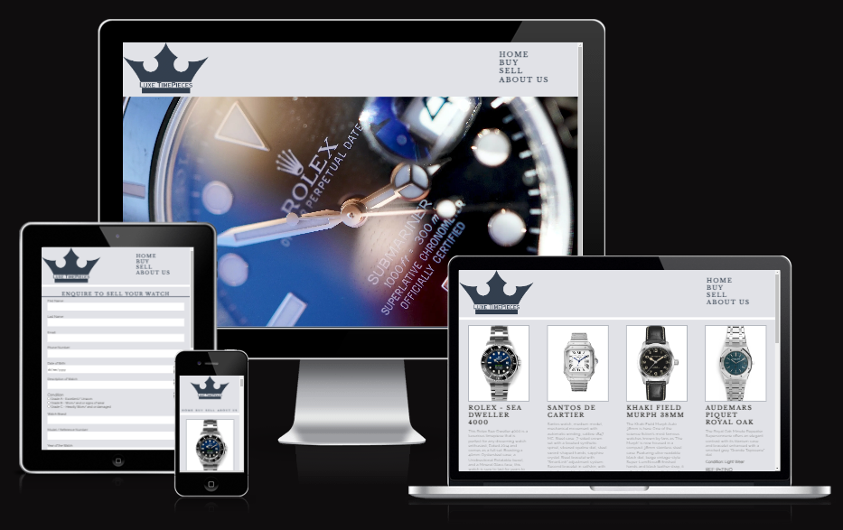
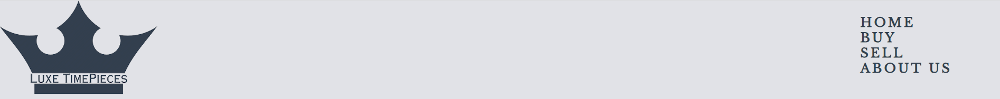
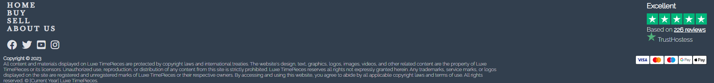
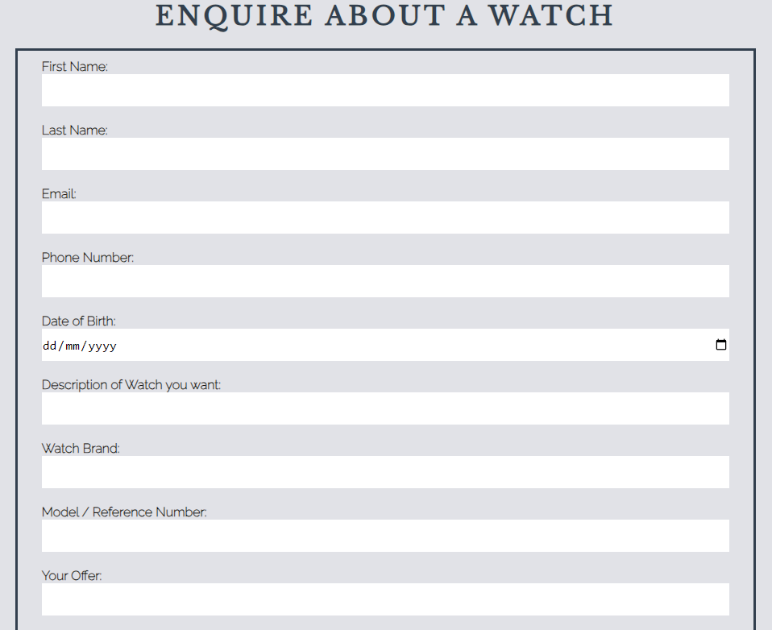
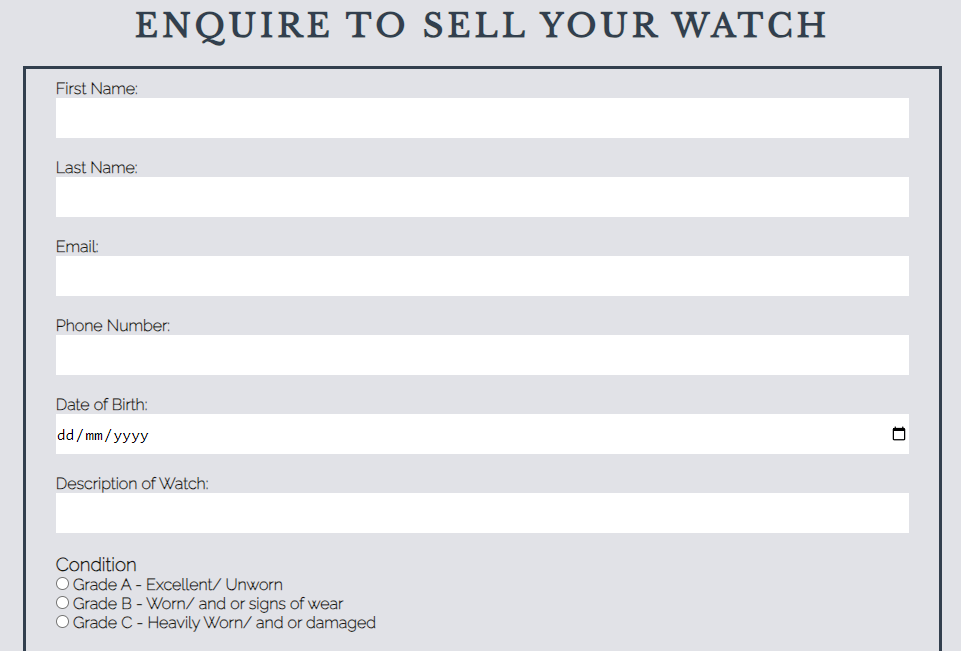
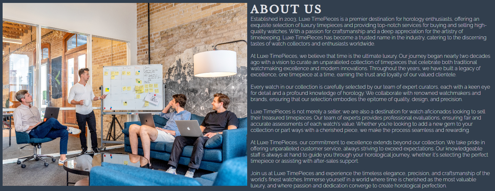
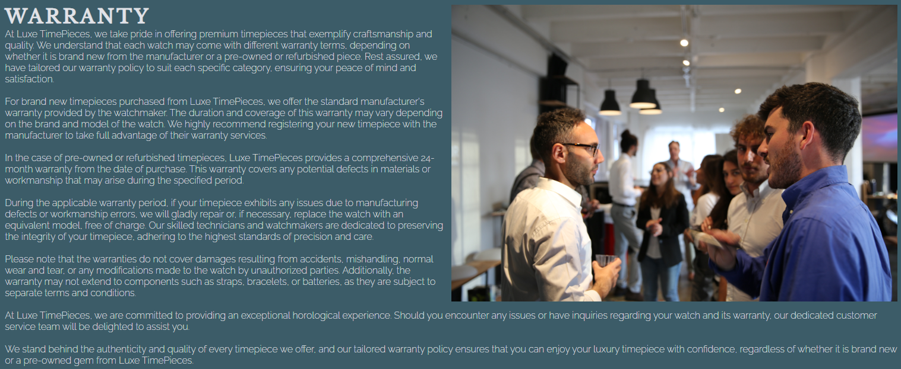

# Luxe TimePieces

Luxe TimePieces, we're dedicated to transforming the way watch enthusiasts experience the world of luxury timepieces. Our mission is simple yet powerful: to provide a seamless platform for both buying and selling watches, all while ensuring trust, authenticity, and accessibility.

Navigating the realm of luxury watches can often be daunting, plagued by counterfeits and complex procedures. That's where we step in. We've built Luxe TimePieces to be your trusted partner, a beacon of authenticity in an industry sometimes clouded by uncertainty. Our commitment is to offer a straightforward solution, connecting passionate individuals with the watches they desire without the barriers and complications that can arise elsewhere.

[View Luxe TimePieces live project here](https://barrycflynn.github.io/Luxe_TimePieces/)
- - -
## Table of Contents

### [User Experience](#user-experience-1)
### [User Stories](#user-stories-1)
### [Features](#features-1)
### [Manual Testing](#manual-testing-1)
### [Pages and Sections](#pages-and-sections-1)
### [Design](#design-1)
### [Technologies Used](#technologies-used-1)
### [Sites & Programs Used](#sites--programs-used-1)
### [Deployment and local development](#deployment-and-local-development-1)
### [Credits](#credits-1)
### [Acknowledgements](#acknowledgements-1)
---

## User Experience

This website is meant to attract people who want to buy or sell Luxury Watches.

There is clear navigation bar in the header and footer of every page and in the same location to make it easy to navigate around the site.

There are two forms to allow to enquire to buy a watch or sell a watch. Each form requests the necessary information to get in contact with the client.

There is also an engaging Hero animation on the landing page, and further on the Buy page there is a hover animation on the advert images.

---

## User Stories

#### First-time visitor goals
* Are engaged by the landing page animations and using clear navigation options to see the latest watch to buy or got straight to filling the form to sell their watch.
#### Returning visitor goals
* Check on new watches available on the site as this will be frequently updated.
#### Frequent user goals
* Check on new watches available on the site as this will be frequently updated.

---

## Features

* This website is targeting people who want to buy or sell luxury watches.
* They can do that by navigating to the buy page, choosing a watch they want to buy and fill out the form to enquire on it.
* They can also navigate to the sell page to provide information on another form to submit.
* The about page holds essential information on the company and warranties we offer.

---

## Manual Testing

* The website was tested on Google Chrome and Microsoft Edge.
* The website was viewed on various monitors and resolutions and on a Pixel 7 mobile phone.
* Vigorous testing was done on links to ensure navigation between pages work correctly.
* Chrome Dev Tools was used to test how the site looks on various screen sizes.

---

## Pages and Sections

Each section below is a collapsing menu that holds the page features, challenges and testing results. 

Expand each section as needed.

Header & Footer

##  Header
* It is featured and fixed on all pages.
* Used flexbox and position the logo and nav bar.
* The Logo was a free design found online (See Credits for references) but modified to fit in the company name and also serves as another link to the home page.
* Includes links to the Home Page, Buy Page, Sell Page, and About Page. 
* It is identical in design across the pages.
* Allows easy navigation from page to page.

    

##  Challenges
Learning the use of Flexbox to manage the layout of the elements which also served to be responsive. But ran into a issue below 610px width where the nav bar would break the header. Used Media Queries to change the flex direction to column and moved nav bar from a list to a row. Had to reduce font size lower screen resolutions with media queries.

## Footer

* Nav bar to add additional navigation options.
* Links to the social media for Luxe TimePieces will open in a new tab to allow easy navigation for the user.
* Copyright information - Text generated by Chat GPT
* Trust Hostess section - this is is a fake company modelled off Trust Pilot and the code was contributed.
* Payment options in the form of SVG images and hover provides text of the option

    

##  Challenges
Learning the use of Flexbox to manage the layout of the elements which also served to be responsive. But there were far more elements to manage and ended up breaking the footer in multiple logical flexbox's. I also learned of SVG files and thought they provided an nice addition as a Accepted Payment method information.

---

Index.html

## Main Feature
* This is a slide show using Javascript to animate through 4 images every 7 seconds.

## Challenges
 I really wanted to have an animated slide show to grab the attention of the user. I tried using only CSS and HTML to manage it but I could not get it to work. So I resorted to using Chat GPT and JavaScript to pull it off. The images were all found on Unsplash (See Credits).

## Testing

Lighthouse  -  PASS

* Mobile

    

* Desktop

    

W3C Markup Validtor - PASS

            

W3C CSS Validator - PASS

        

Responsive - PASS

* Resolutions checked

    - 320x568: Used by small smartphones or devices in portrait mode.
    - 375x667: Used by smartphones like iPhone 6/7/8 in portrait mode.
    - 360x640: Common resolution for many budget and mid-range smartphones.
    - 414x896: Found on various iPhone models like iPhone X, XS, 11 Pro, and 12 Pro.
    - 768x1024: Common resolution for tablets in portrait mode, such as the iPad.
    - 1024x768: Another common resolution for tablets, especially in landscape mode.
    - 1280x800: Common resolution for smaller laptops and tablets.
    - 1366x768: Common for laptops and desktop monitors.
    - 1920x1080: Full HD resolution, used on larger monitors, laptops, and some mobile   devices.
    

---

Buy.html

## Main Feature
* A Grid layout to manage each advert, Shows a number of options in a grid with images, watch information, price and warranties.
* Hover over any of the Images a there is a short zoom animation, controlled with css.
* Each advert has a button that will direct to a form on contact.html to enquire about a watch this was because I did not know how to setup a shopping cart and thought this was the best option.
* Information such as Images, pricing and text where provided by manufacturer websites or known 2nd hand luxury watch merchants (See Credits) to give an authentic advert.

## Challenges
 I initially tried using Flex Box but could not get the last row to align left and still maintain the column alignment, in research I found a guide on Grid which managed the Ads much they way I wanted. And when making it responsive grid did a good job of scaling the columns a bit and it was easy to add media queries to reduce the columns when is was needed.

## Testing

Lighthouse  -  PASS

* Mobile

    

* Desktop

    

W3C Markup Validtor - PASS

            

W3C CSS Validator - PASS

        

Responsive - PASS

* Resolutions checked

    - 320x568: Used by small smartphones or devices in portrait mode.
    - 375x667: Used by smartphones like iPhone 6/7/8 in portrait mode.
    - 360x640: Common resolution for many budget and mid-range smartphones.
    - 414x896: Found on various iPhone models like iPhone X, XS, 11 Pro, and 12 Pro.
    - 768x1024: Common resolution for tablets in portrait mode, such as the iPad.
    - 1024x768: Another common resolution for tablets, especially in landscape mode.
    - 1280x800: Common resolution for smaller laptops and tablets.
    - 1366x768: Common for laptops and desktop monitors.
    - 1920x1080: Full HD resolution, used on larger monitors, laptops, and some mobile   devices.
    

---

Contact.html

## Main Feature
* This is a form to provide information on contacting for a watch on the buy page. This could also later be added as another page on the Nav bar to allow customers to enquire on any watch that we could source for them. 
* Numerous questions using an array of inputs including radio, checkbox, Country and select.
* On Submit will direct to thanks.html which is the form submit acknowledgment page.

## Challenges
I had to come up with a way to finish the site without having the complexities of a shopping cart, I believed another form to allow users to enquire on adverts was a work around. A shopping cart could be added later on and the sell.html form was used as the basis but a number of question removed. This allowed me to keep the same layouts to ease navigation.

## Testing

Lighthouse  -  PASS

* Mobile

    

* Desktop

    

W3C Markup Validtor - PASS

            

W3C CSS Validator - PASS

        

Responsive - PASS

* Resolutions checked

    - 320x568: Used by small smartphones or devices in portrait mode.
    - 375x667: Used by smartphones like iPhone 6/7/8 in portrait mode.
    - 360x640: Common resolution for many budget and mid-range smartphones.
    - 414x896: Found on various iPhone models like iPhone X, XS, 11 Pro, and 12 Pro.
    - 768x1024: Common resolution for tablets in portrait mode, such as the iPad.
    - 1024x768: Another common resolution for tablets, especially in landscape mode.
    - 1280x800: Common resolution for smaller laptops and tablets.
    - 1366x768: Common for laptops and desktop monitors.
    - 1920x1080: Full HD resolution, used on larger monitors, laptops, and some mobile   devices.
    

---

Sell.html

## Main Feature
* This is the main form of the site and serves to provide a way for a user to offer to sell their watch on the site.
* Numerous questions using an array of inputs including file upload, checkbox, radio, country select, email and date of birth.
* On Submit will direct to thanks.html which is the form submit acknowledgment page

## Challenges
 I really wanted the main form to be a questionnaire on opting to sell a watch, this allowed the use of many input types to gather the necessary information for sourcing luxury watches from anywhere in the world.

## Testing

Lighthouse  -  PASS

* Mobile

    

* Desktop

    

W3C Markup Validtor - PASS

            

W3C CSS Validator - PASS

        

Responsive - PASS

* Resolutions checked

    - 320x568: Used by small smartphones or devices in portrait mode.
    - 375x667: Used by smartphones like iPhone 6/7/8 in portrait mode.
    - 360x640: Common resolution for many budget and mid-range smartphones.
    - 414x896: Found on various iPhone models like iPhone X, XS, 11 Pro, and 12 Pro.
    - 768x1024: Common resolution for tablets in portrait mode, such as the iPad.
    - 1024x768: Another common resolution for tablets, especially in landscape mode.
    - 1280x800: Common resolution for smaller laptops and tablets.
    - 1366x768: Common for laptops and desktop monitors.
    - 1920x1080: Full HD resolution, used on larger monitors, laptops, and some mobile   devices.
    

---

About.html

## Main Feature
* Page provides images of company staff and two sections regarding "About Us" and "Warranty" information. Text was Generated by Chat GPT to provide a sufficiently large and appropriate text to fill the space.

## Challenges
 Getting the Images to flow correctly at different resolutions, starting using a flexbox to manage the responsiveness but found the it worked better without it. Just using Float and fixed width scaled the image nicely and only had to change the layout at 610px width to have the image appear above the text.
## Testing

Lighthouse  -  PASS

* Mobile

    

* Desktop

    

W3C Markup Validtor - PASS

            

W3C CSS Validator - PASS

        

Responsive - PASS

* Resolutions checked

    - 320x568: Used by small smartphones or devices in portrait mode.
    - 375x667: Used by smartphones like iPhone 6/7/8 in portrait mode.
    - 360x640: Common resolution for many budget and mid-range smartphones.
    - 414x896: Found on various iPhone models like iPhone X, XS, 11 Pro, and 12 Pro.
    - 768x1024: Common resolution for tablets in portrait mode, such as the iPad.
    - 1024x768: Another common resolution for tablets, especially in landscape mode.
    - 1280x800: Common resolution for smaller laptops and tablets.
    - 1366x768: Common for laptops and desktop monitors.
    - 1920x1080: Full HD resolution, used on larger monitors, laptops, and some mobile   devices.
    

---

Thanks.html

## Main Feature
* After filling out either the Contact or Sell forms the submit button will direct to a thank you page with a simple message.

## Challenges
Getting the forms to direct to the page took a lot of research. As in previous lessons we were shown the method="post" but this gave me an error. After research I got it working by removing the "method" attribute completely. 

## Testing

Lighthouse  -  PASS

* Mobile

    

* Desktop

    

W3C Markup Validtor - PASS

            

W3C CSS Validator - PASS

Responsive - PASS

* Resolutions checked

    - 320x568: Used by small smartphones or devices in portrait mode.
    - 375x667: Used by smartphones like iPhone 6/7/8 in portrait mode.
    - 360x640: Common resolution for many budget and mid-range smartphones.
    - 414x896: Found on various iPhone models like iPhone X, XS, 11 Pro, and 12 Pro.
    - 768x1024: Common resolution for tablets in portrait mode, such as the iPad.
    - 1024x768: Another common resolution for tablets, especially in landscape mode.
    - 1280x800: Common resolution for smaller laptops and tablets.
    - 1366x768: Common for laptops and desktop monitors.
    - 1920x1080: Full HD resolution, used on larger monitors, laptops, and some mobile   devices.
    

---
## Design

### Colour Scheme
* The primary background colour originated from the source of the Crown Logo (see credits) and decided to incorporate it as the primary background colour. Using a color picking tool found the other remaining colours to provide contrast and compliment each other.
    * Primary Background Colour

        
    * Secondary Background Colour

        
    * Primary Text and Background Colour
    
        

    * Contrast Grid - Only AA and AAA options used.

        
            

### Fonts
* 'Raleway' font is main font used throughout the site with 'Sans-serif' as its fallback font.
* 'Libre Baskerville' is use on headings and has 'Serif' as the fallback font.

### Layout
* Reviewed a number of Watch reseller sites to see what was best practices on layout. This predominantly a bold Logo and a Hero video or animation on the landing page. Leading to either a single page layout or a multiple page layout. I opted for multiple page, 6 in total to adequately add all the features I was looking for.
* Each page should follow similar layouts to ease navigation and use.

---

## Technologies Used

 * HTML
 * CSS
 * JavaScript
 * ChatGPT
 
---

## Sites & Programs Used

* [VS Code](https://code.visualstudio.com/)
    * Code editor.
* [Git](https://git-scm.com/)
    * To manage version control and push updates to GitHub.
* [Github](https://github.com/)
    * File Storage and Hosting the website.
* [Google Fonts](https://fonts.google.com/)
    * Import main font the website.
* [Chat GPT](https://openai.com/blog/chatgpt)
    * Only used for troubleshooting, Javascript for the Hero Animation and text.
* [Am I Responsive](https://ui.dev/amiresponsive)
    * Mockup picture for the README file.
* [Gimp](https://www.gimp.org/)
    * Image editing program, used on format conversion, image scaling, and editing.
* [Unsplash](https://unsplash.com/)
    * Source of Stock Photos used in Hero slide show
* [8 Shapes Contrast Grid](contrast-grid.eightshapes.com)
    * Used to make sure colours are compliant.
* [YouTube](https://www.youtube.com/)
    * Source of guides on Flex Box and Grid
* [Adobe Color](https://color.adobe.com/create/color-wheel)
    * Used to select colours on the site
* [Pinterest](https://www.pinterest.ie/)
    * Source of Logo Design

## Deployment and local development

### GitHub Pages

GitHub Pages used to deploy live version of the website.
1. Log in to GitHub and locate [GitHub Repository Luxe TimePieces](https://barrycflynn.github.io/Luxe_TimePieces/)
2. At the top of the Repository(not the main navigation) locate "Settings" button on the menu.
3. Scroll down the Settings page until you locate "GitHub Pages".
4. Under "Source", click the dropdown menu "None" and select "Main" and click "Save".
5. The page will automatically refresh.
6. Scroll back to locate the now-published site [link](https://barrycflynn.github.io/Luxe_TimePieces/) in the "GitHub Pages" section.

---

## Credits

* [PNG Share on Pinterest](https://www.pinterest.com/pin/crown-png-logo-hd-png-download--678073287641478431/) Logo Design from Creator PNG Share, this served as the logo after editing to add the company name and the source of primary colour for the site.
* [Edward Castano on Code Pen](https://codepen.io/edcastano/pen/rLoqxo) Code Pen Trust Pilot Footer element
    * Modified further by simplifying the code which had a carousel and renaming to Trust Hostess to demonstrate for the project.
* [Unsplash](https://unsplash.com/) The internet’s source for visuals.
    * hero_bg - https://unsplash.com/photos/Zkf5HBAbQWc
    * hero_slide1 - https://unsplash.com/photos/Rm7Qbb1FyQM
    * hero_slide2 - https://unsplash.com/photos/AChwtt3tBPU
    * hero_slide3 - https://unsplash.com/photos/VRERJ5Mjp4c
    * founder1 - https://unsplash.com/photos/wD1LRb9OeEo
    * founder2 - https://unsplash.com/photos/yTsy3PYFPtc
* Watch images and information was sourced either from watch manufacturer website or [Pride & Pinion](https://prideandpinion.com/)
* [Danrovito on GitHub](https://gist.github.com/danrovito/977bcb97c9c2dfd3398a) Country Select input on contact.html and sell.html found this repository to help.

---

## Acknowledgements

 * My mentor Mitko Bachvarov provided helpful feedback.