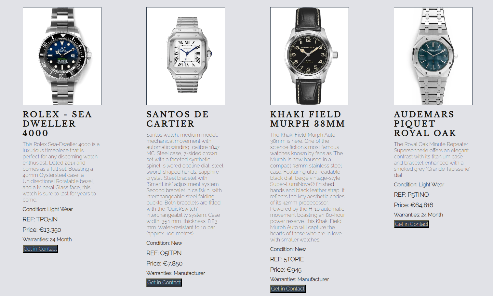

# Luxe TimePieces

Luxe TimePieces, we're dedicated to transforming the way watch enthusiasts experience the world of luxury timepieces. Our mission is simple yet powerful: to provide a seamless platform for both buying and selling watches, all while ensuring trust, authenticity, and accessibility.

Navigating the realm of luxury watches can often be daunting, plagued by counterfeits and complex procedures. That's where we step in. We've built Luxe TimePieces to be your trusted partner, a beacon of authenticity in an industry sometimes clouded by uncertainty. Our commitment is to offer a straightforward solution, connecting passionate individuals with the watches they desire without the barriers and complications that can arise elsewhere.

[View Luxe TimePieces live project here](https://barrycflynn.github.io/Luxe_TimePieces/)
- - -
## Table of Contents

### [User Experience (UX)](#user-experience-ux-1)
* [User Stories](#user-stories)
### [Features](#features)
* [Existing Features](#existing-features)
### [Features Left to Implement](#features-left-to-implement-1)
### [Design](#design-1)
### [Technologies Used](#technologies-used-1)
### [Frameworks, Libraries & Programs Used](#frameworks-libraries--programs-used-1)
### [Testing](#testing-1)
* [Validation Results](#validation-results)
* [Manual Testing](#manual-testing)
* [Lighthouse Report](#lighthouse-report)
### [Deployment and local development](#deployment-and-local-development-1)
* [GitHub Pages](#github-pages)
* [Forking the GitHub Repository](#forking-the-github-repository)
* [Local Clone](#local-clone)
### [Credits](#credits-1)
### [Acknowledgements](#acknowledgements-1)
---

## User Experience (UX)

This website is meant to attract people who want to buy or sell Luxury Watches.

There is clear navigation and two forms to allow to enquire on a watch to buy or sell a watch. Each form requests the necessary information to get in contact with the client.

---

## User Stories

#### First-time visitor goals
* Are engaged by the landing page animations and using clear navigation options to see the latest watch to buy or got straight to filling the form to sell their watch.
#### Returning visitor goals
* Check on new watches available on the site as this will be frequently updated.
#### Frequent user goals
* Check on new watches available on the site as this will be frequently updated.

---

## Features

* This website is targeting people who want to buy or sell luxury watches.
* They can do that by navigating buy page, choosing a watch they want to buy on and fill out a form to enquire on it.
* They can also navigate to the sell page to provide information on another form to submit.

---

## Design

* Colour Scheme
    * Primary colors used on the website, the primary background colour orginiated from the source of the Crown Logo (see credits) and decided to incorporate it as the primary background colour. and using a color picking tool found the other remaining colours to provide contrast and compliment each other.
        * Primary Background Colour

            
        * Secondary Background Colour

            
        * Primary Text and Background Colour
        
            

* Fonts
    * Raleway font is main font used throughout the site with sans-serif as its fallback font.
    * Libre Baskerville is use on headings and has serif as the fallback font.

* Layout
    * reviewed a number of Watch reseller sites to see what was best practices on layout.
---

## Technologies Used

 * HTML
 * CSS
 * JavaScript
 * ChatGPT
 
---

## Sites & Programs Used

* [VS Code](https://code.visualstudio.com/)
    * Code editor.
* [Git](https://git-scm.com/)
    * To manage version control and push updates to GitHub.
* [Github](https://github.com/)
    * File Storage and Hosting the website.
* [Google Fonts](https://fonts.google.com/)
    * Import main font the website.
* [Chat GPT](https://openai.com/blog/chatgpt)
    * Only used for troubleshooting, Javascript for the Hero Animation and text.
* [Am I Responsive](https://ui.dev/amiresponsive)
    * Mockup picture for the README file.
* [Gimp](https://www.gimp.org/)
    * Image editing program, used on format conversion, image scaling, and image editing.
* [Unsplash](https://unsplash.com/)
    * Source of Stock Photos used in Hero slide show
* [8 Shapes Contrast Grid](contrast-grid.eightshapes.com)
    * Used to make sure colours were compliant.
* [YouTube](https://www.youtube.com/)
    * Source of guides on Flex Box and Grid
* [Adobe Color](https://color.adobe.com/create/color-wheel)
    * Used to select colours on the site
* [Pinterest](https://www.pinterest.ie/)
    * Source of Logo Design

---

## Testing

* The website was tested on Google Chrome and Microsoft Edge.
* The website was viewed on various monitors and resolutions and on a Pixel 7 mobile phone.
* Vigorous testing was done on links to ensure navigation between pages work correctly.
* Chrome Dev Tools was used to test how the site looks on various screen sizes.
* Light House was used to check performance on every page.
* The W3C validators for HTML and CSS were used on every page to ensure the code meets industry requirements.

---

## Deployment and local development

### GitHub Pages

GitHub Pages used to deploy live version of the website.
1. Log in to GitHub and locate [GitHub Repository Lunar Escape](https://github.com/Thomas-Tomo/Lunar-Escape)
2. At the top of the Repository(not the main navigation) locate "Settings" button on the menu.
3. Scroll down the Settings page until you locate "GitHub Pages".
4. Under "Source", click the dropdown menu "None" and select "Main" and click "Save".
5. The page will automatically refresh.
6. Scroll back to locate the now-published site [link](https://thomas-tomo.github.io/Lunar-Escape/index.html) in the "GitHub Pages" section.

## Pages and Sections

Template

## Main Feature
* 
## Challenges
* 
## Testing

Lighthouse  -  PASS

* Mobile

    

* Desktop

    

W3C Markup Validtor - PASS

            

W3C CSS Validator - PASS

        

Responsive - PASS

* Resolutions checked

    - 320x568: Used by small smartphones or devices in portrait mode.
    - 375x667: Used by smartphones like iPhone 6/7/8 in portrait mode.
    - 360x640: Common resolution for many budget and mid-range smartphones.
    - 414x896: Found on various iPhone models like iPhone X, XS, 11 Pro, and 12 Pro.
    - 768x1024: Common resolution for tablets in portrait mode, such as the iPad.
    - 1024x768: Another common resolution for tablets, especially in landscape mode.
    - 1280x800: Common resolution for smaller laptops and tablets.
    - 1366x768: Common for laptops and desktop monitors.
    - 1920x1080: Full HD resolution, used on larger monitors, laptops, and some mobile   devices.
    

Header & Footer

- Header
    * It is featured and fixed on all pages.
    * used flexbox and position the logo and nav bar.
    * The Logo was a free design found online (See Credits for references) but modified to fit in the company name and also serves as another link to the home page.
    * Includes links to the Home Page, Buy Page, Sell Page, and About Page. 
    * It is identical in design across the pages.
    * Allows easy navigation from page to page.

    

    Challenges
- Footer
    * Nav bar to add additional navigation options.
    * Links to the social media for Luxe TimePieces will open in a new tab to allow easy navigation for the user.
    * Copyright information
    * Trust Hostess section - this is is a fake company modelled off Trust Pilot and the code was contributed.
    * Payment options in the form of SVG images and hover provides text of the option

    

Index.html

## Main Feature
* This is a slide show using Javascript to animate through 4 images every 7 seconds.

## Challenges

* I really wanted to have an animated slide show to grab the attention of the user. I tried using only CSS and HTML to manage it but I could not get it to work. So I resorted to using Chat GPT and JavaScript to pull it off.

## Testing

Lighthouse  -  PASS

* Mobile

    

* Desktop

    

W3C Markup Validtor - PASS

            

W3C CSS Validator - PASS

        

Responsive - PASS

* Resolutions checked

    - 320x568: Used by small smartphones or devices in portrait mode.
    - 375x667: Used by smartphones like iPhone 6/7/8 in portrait mode.
    - 360x640: Common resolution for many budget and mid-range smartphones.
    - 414x896: Found on various iPhone models like iPhone X, XS, 11 Pro, and 12 Pro.
    - 768x1024: Common resolution for tablets in portrait mode, such as the iPad.
    - 1024x768: Another common resolution for tablets, especially in landscape mode.
    - 1280x800: Common resolution for smaller laptops and tablets.
    - 1366x768: Common for laptops and desktop monitors.
    - 1920x1080: Full HD resolution, used on larger monitors, laptops, and some mobile   devices.
    

Buy.html

## Main Feature
* A Grid layout to manage each advert, Shows a number of options in a grid with images, watch information, price and warranties.
* Each advert has a button that will direct to a form on contact.html to enquire about a watch this was because I did not know how to setup a shopping cart and thought this was the best option.

## Challenges
* I initially tried using Flex Box but could not get the last row to align left and still maintain the column alignment, in research I found a guide on Grid managed the Ads much betterh easier. And when making it responsive it was easy to add media queries to reduce the columns when is was needed.

## Testing

Lighthouse  -  PASS

* Mobile

    

* Desktop

    

W3C Markup Validtor - PASS

            

W3C CSS Validator - PASS

        

Responsive - PASS

* Resolutions checked

    - 320x568: Used by small smartphones or devices in portrait mode.
    - 375x667: Used by smartphones like iPhone 6/7/8 in portrait mode.
    - 360x640: Common resolution for many budget and mid-range smartphones.
    - 414x896: Found on various iPhone models like iPhone X, XS, 11 Pro, and 12 Pro.
    - 768x1024: Common resolution for tablets in portrait mode, such as the iPad.
    - 1024x768: Another common resolution for tablets, especially in landscape mode.
    - 1280x800: Common resolution for smaller laptops and tablets.
    - 1366x768: Common for laptops and desktop monitors.
    - 1920x1080: Full HD resolution, used on larger monitors, laptops, and some mobile   devices.
    

Contact.html

## Main Feature
* This is a form to provide information on contacting for a watch on the buy page. This could also later be added as another page on the Nav bar to allow customers to enquire on any watch that we could source for them. Not only on the available adverts. 
* Numerous questions using an array of inputs including radio, checkbox, Country and select
* On Submit will direct to thanks.html which is the form submit acknowledgment page

## Challenges
* I had to come up with a way to finish the site without having the complexities of a shopping cart, I believed another form to allow users to enquire on adverts was a work around. A shopping cart could be added later on.

## Testing

Lighthouse  -  PASS

* Mobile

    

* Desktop

    

W3C Markup Validtor - PASS

            

W3C CSS Validator - PASS

        

Responsive - PASS

* Resolutions checked

    - 320x568: Used by small smartphones or devices in portrait mode.
    - 375x667: Used by smartphones like iPhone 6/7/8 in portrait mode.
    - 360x640: Common resolution for many budget and mid-range smartphones.
    - 414x896: Found on various iPhone models like iPhone X, XS, 11 Pro, and 12 Pro.
    - 768x1024: Common resolution for tablets in portrait mode, such as the iPad.
    - 1024x768: Another common resolution for tablets, especially in landscape mode.
    - 1280x800: Common resolution for smaller laptops and tablets.
    - 1366x768: Common for laptops and desktop monitors.
    - 1920x1080: Full HD resolution, used on larger monitors, laptops, and some mobile   devices.
    

Sell.html

## Main Feature
* This is the main form of the site and serves to provide a way for a user to offer to sell their watch on the site.
* Numerous questions using an array of inputs.
* On Submit will direct to thanks.html which is the form submit acknowledgment page

## Challenges
* I really wanted the main form to be a questionnaire on opting to sell a watch, this allowed the use of many input types.

## Testing

Lighthouse  -  PASS

* Mobile

    

* Desktop

    

W3C Markup Validtor - PASS

            

W3C CSS Validator - PASS

        

Responsive - PASS

* Resolutions checked

    - 320x568: Used by small smartphones or devices in portrait mode.
    - 375x667: Used by smartphones like iPhone 6/7/8 in portrait mode.
    - 360x640: Common resolution for many budget and mid-range smartphones.
    - 414x896: Found on various iPhone models like iPhone X, XS, 11 Pro, and 12 Pro.
    - 768x1024: Common resolution for tablets in portrait mode, such as the iPad.
    - 1024x768: Another common resolution for tablets, especially in landscape mode.
    - 1280x800: Common resolution for smaller laptops and tablets.
    - 1366x768: Common for laptops and desktop monitors.
    - 1920x1080: Full HD resolution, used on larger monitors, laptops, and some mobile   devices.
    

About.html

## Main Feature
* Page provides images of company staff and two sections regarding "About Us" and "Warranty" information. Text was Generated by Chat GPT to provide a sufficiently large and appropriate text to fill the space.

## Challenges
* Getting the Images to flow correctly at different resolutions.
## Testing

Lighthouse  -  PASS

* Mobile

    

* Desktop

    

W3C Markup Validtor - PASS

            

W3C CSS Validator - PASS

        

Responsive - PASS

* Resolutions checked

    - 320x568: Used by small smartphones or devices in portrait mode.
    - 375x667: Used by smartphones like iPhone 6/7/8 in portrait mode.
    - 360x640: Common resolution for many budget and mid-range smartphones.
    - 414x896: Found on various iPhone models like iPhone X, XS, 11 Pro, and 12 Pro.
    - 768x1024: Common resolution for tablets in portrait mode, such as the iPad.
    - 1024x768: Another common resolution for tablets, especially in landscape mode.
    - 1280x800: Common resolution for smaller laptops and tablets.
    - 1366x768: Common for laptops and desktop monitors.
    - 1920x1080: Full HD resolution, used on larger monitors, laptops, and some mobile   devices.
    

Thanks.html

## Main Feature
* After filling out either the Contact or Sell forms the submit button will direct to a thank you page with a simple message.

## Challenges
* Getting the Images to flow correctly at different resolutions.
## Testing

Lighthouse  -  PASS

* Mobile

    

* Desktop

    

W3C Markup Validtor - PASS

            

W3C CSS Validator - PASS

Responsive - PASS

* Resolutions checked

    - 320x568: Used by small smartphones or devices in portrait mode.
    - 375x667: Used by smartphones like iPhone 6/7/8 in portrait mode.
    - 360x640: Common resolution for many budget and mid-range smartphones.
    - 414x896: Found on various iPhone models like iPhone X, XS, 11 Pro, and 12 Pro.
    - 768x1024: Common resolution for tablets in portrait mode, such as the iPad.
    - 1024x768: Another common resolution for tablets, especially in landscape mode.
    - 1280x800: Common resolution for smaller laptops and tablets.
    - 1366x768: Common for laptops and desktop monitors.
    - 1920x1080: Full HD resolution, used on larger monitors, laptops, and some mobile   devices.
    

---

## Credits

### Content

 * Logo Design from Creator PNG SHare (https://www.pinterest.com/pin/crown-png-logo-hd-png-download--678073287641478431/)
 * [Unsplash](https://unsplash.com/) The internet’s source for visuals.
    * hero_bg - https://unsplash.com/photos/Zkf5HBAbQWc
    * hero_slide1 - https://unsplash.com/photos/Rm7Qbb1FyQM
    * hero_slide2 - https://unsplash.com/photos/AChwtt3tBPU
    * hero_slide3 - https://unsplash.com/photos/VRERJ5Mjp4c
    * founder1 - https://unsplash.com/photos/wD1LRb9OeEo
    * founder2 - https://unsplash.com/photos/yTsy3PYFPtc
* [Danrovito](https://gist.github.com/danrovito/977bcb97c9c2dfd3398a) Country Select input on contact.html and sell.html found this repository to help.
---

## Acknowledgements

 * My mentor Mitko Bachvarov provided helpful feedback.