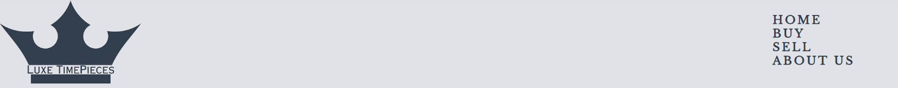

# Luxe TimePieces

Luxe TimePieces, we're dedicated to transforming the way watch enthusiasts experience the world of luxury timepieces. Our mission is simple yet powerful: to provide a seamless platform for both buying and selling watches, all while ensuring trust, authenticity, and accessibility.

Navigating the realm of luxury watches can often be daunting, plagued by counterfeits and complex procedures. That's where we step in. We've built Luxe TimePieces to be your trusted partner, a beacon of authenticity in an industry sometimes clouded by uncertainty. Our commitment is to offer a straightforward solution, connecting passionate individuals with the watches they desire without the barriers and complications that can arise elsewhere.

[View Luxe TimePieces live project here](https://barrycflynn.github.io/Luxe_TimePieces/)
- - -
## Table of Contents

### [User Experience (UX)](#user-experience-ux-1)
* [User Stories](#user-stories)
### [Features](#features)
* [Existing Features](#existing-features)
### [Features Left to Implement](#features-left-to-implement-1)
### [Design](#design-1)
### [Technologies Used](#technologies-used-1)
### [Frameworks, Libraries & Programs Used](#frameworks-libraries--programs-used-1)
### [Testing](#testing-1)
* [Validation Results](#validation-results)
* [Manual Testing](#manual-testing)
* [Lighthouse Report](#lighthouse-report)
### [Deployment and local development](#deployment-and-local-development-1)
* [GitHub Pages](#github-pages)
* [Forking the GitHub Repository](#forking-the-github-repository)
* [Local Clone](#local-clone)
### [Credits](#credits-1)
### [Acknowledgements](#acknowledgements-1)
---

## User Experience (UX)

This website is meant to attract people who want to buy or sell Luxury Watches.

There is clear navigation and two forms to allow to enquire on a watch to buy or sell a watch. Each form requests the necessary information to get in contact with the client.

## User Stories

#### First-time visitor goals
    Are engaged by the landing page animations and using clear navigation options to see the latest watch to buy or got straight to filling the form to sell their watch.
#### Returning visitor goals
    Check on new watches available on the site as this will be frequently updated.
#### Frequent user goals
    Check on new watches available on the site as this will be frequently updated.

## Features

* This website is targeting people who want to buy or sell luxury watches.
* They can do that by navigating buy page, choosing a watch they want to buy on and fill out a form to enquire on it.
* They can also navigate to the sell page to provide information on another form to submit.

### Existing Features

* Header
    * It is featured and fixed on all pages.
    * The Logo was a free design found online (See Credits for references) but modified to fit in the company name and also serves as another link to the home page.
    * Includes links to the Home Page, Buy Page, Sell Page, and About Page. 
    * It is identical in design across the pages.
    * Allows easy navigation from page to page.

* Main heading
    * This is a slide show using Javascript to animate through 4 images

* Footer
    * Nav bar to add additional navigation options.
    * Links to the social media for Luxe TimePieces will open in a new tab to allow easy navigation for the user.
    * Copyright information
    * A Trust Hostess section
    * Payment options in the form of SVG images and hover provides text of the option

* Buy Page
    * Shows a number of options in a grid with images, watch information, price and warranties.
    * Each advert has a button that will direct to a form to enquire about a watch.

* Contact Page
    * This is a form to provide information on contacting for a watch on the buy page. 
    * Numerous questions using an array of inputs including file upload, radio, checkbox, country and select

* Sell Page
    * This is a form to provide information on selling a watch.
    * Numerous questions using an array of inputs.

* About Us Page
    * Page provides images of company staff and two section regarding "About Us" and "Warranty" information

* Thank You Page
    * After filling out either the Contact or Sell forms the submit button will direct to a thank you page with a simple message.

---
## Design

* Colour Scheme
    * Primary colors used on the website:

    
    
    

* Fonts
    * Raleway font is main font used throughout the site with sans-serif as its fallback font.
    * Libre Baskerville is use on headings and has serif as the fallback font.

* Layout
    * reviewed a number of Watch reseller sites to see what was best practices on layout.
---

## Technologies Used

 * HTML
 * CSS
 * JavaScript

---

## Frameworks, Libraries & Programs Used

 * [VS Code](https://code.visualstudio.com/)
    * To write the code.
 * [Git](https://git-scm.com/)
    * To manage version control.
 * [Github](https://github.com/)
    * File Storage and Hosting the website
 * [Google Fonts](https://fonts.google.com/)
    * Import main font the website.
* [Am I Responsive](https://ui.dev/amiresponsive)
    * Mockup picture for the README file.
---

## Testing

The W3C Markup Validator and W3C CSS Validator services were used to validate every page of the project to ensure there were no errors.

 * [W3C Markup Validtor](https://validator.w3.org/)
 * [W3C CSS Validator](https://jigsaw.w3.org/css-validator/)

### Validation results

index.html

gallery.html

sign-up.html

form-received.htmml

style.css

### Manual Testing

* The website was tested on Google Chrome, Microsoft Edge, and Opera browsers.
* The website was viewed on a desktop computer, laptop, and Samsung Galaxy A52 mobile phone.
* A large amount of testing was done to ensure links between pages are working correctly on all pages.
* Family and friends were asked to review the website for a better understanding of the user experience.
* Dev Tools was used to test how the site looks on various screen sizes.

### Lighthouse Report

#### Mobile analysis

Home Page

Gallery

Sign Up

Application Received

#### Desktop analysis

Home Page

Gallery

Sign Up

Application Received

---

## Deployment and local development

### GitHub Pages

GitHub Pages used to deploy live version of the website.
1. Log in to GitHub and locate [GitHub Repository Lunar Escape](https://github.com/Thomas-Tomo/Lunar-Escape)
2. At the top of the Repository(not the main navigation) locate "Settings" button on the menu.
3. Scroll down the Settings page until you locate "GitHub Pages".
4. Under "Source", click the dropdown menu "None" and select "Main" and click "Save".
5. The page will automatically refresh.
6. Scroll back to locate the now-published site [link](https://thomas-tomo.github.io/Lunar-Escape/index.html) in the "GitHub Pages" section.

### Forking the GitHub Repository

By forking the repository, we make a copy of the original repository on our GitHub account to view and change without affecting the original repository by using these steps:

1. Log in to GitHub and locate [GitHub Repository Lunar Escape](https://github.com/Thomas-Tomo/Lunar-Escape)
2. At the top of the Repository(under the main navigation) locate "Fork" button.
3. Now you should have a copy of the original repository in your GitHub account.

### Local Clone

1. Log in to GitHub and locate [GitHub Repository Lunar Escape](https://github.com/Thomas-Tomo/Lunar-Escape)
2. Under the repository name click "Clone or download"
3. Click on the code button, select clone with HTTPS, SSH or GitHub CLI and copy the link shown.
4. Open Git Bash
5. Change the current working directory to the location where you want the cloned directory to be made.
6. Type `git clone` and then paste The URL copied in the step 3.
7. Press Enter and your local clone will be created.

---

## Credits

### Code
 * Understanding the concept of flexbox was learned through [Complete Guide to Flexbox](https://css-tricks.com/snippets/css/a-guide-to-flexbox/)
 * The README template was helpfully provided by [Code Institute (template)](https://github.com/Code-Institute-Solutions/SampleREADME)

### Content

 * All content was written by the developer.
 * [Color contrast checker](https://coolors.co/contrast-checker/112a46-acc8e5) was used to decide which colors would be used for the website.

### Media 

 * [Pexels](https://www.pexels.com/) free stock photos, royalty free images.
 * [Pixabay](https://pixabay.com/) free stock photos, royalty free images.
 * [Pixlr](https://pixlr.com/) Resizing images.
---

## Acknowledgements

 * My mentor Mitko Bachvarov provided helpful feedback and a link to the Flexbox guide.
 * Slack community for encouragement and information.